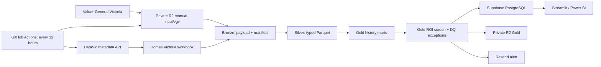

# Victorian Home Investment Data Platform

An end-to-end data engineering project that converts Victorian Government property data into a governed suburb-level investment screening dataset. The current deployment uses free-tier services: GitHub Actions, private Cloudflare R2 object storage, Supabase PostgreSQL, Python and an optional Streamlit dashboard.

**Live dashboard:** [Victorian Home Investment Screen](https://victorian-home-data-platform-khqoosevqis9pzjyzkd2se.streamlit.app/)

> The ROI output is an indicative research screen, not a valuation, forecast or financial recommendation. It excludes vacancy, finance, tax, maintenance, rates, insurance, strata and transaction costs.

## What is running

- Official Valuer-General Victoria annual house, unit and vacant-land workbooks
- Official Homes Victoria quarterly moving-annual rental data discovered through DataVic
- Bronze, Silver and Gold medallion layers in private Cloudflare R2
- A constrained Gold relational model in Supabase PostgreSQL
- A scheduled GitHub Actions refresh every 12 hours
- Structured JSONL logs and seven-day failure artifacts
- Content-hash idempotency for source workbooks and alerts
- Conservative suburb matching with an auditable crosswalk
- Streamlit and Power BI consumption paths
- An optional Azure architecture for a later enterprise migration

The first production Gold publication completed successfully on 6 September 2026. The source workbooks produced 16,241 Silver price observations: 8,739 house, 5,092 unit and 2,410 residential-land rows.

## Architecture



Bronze preserves source evidence, Silver is the reusable quality-controlled contract, and Gold contains decision-ready products. Publishing uses a PostgreSQL staging table and transaction so an invalid or empty run cannot erase the last certified result.

Read the detailed [architecture](docs/architecture.md), [medallion design](docs/medallion-architecture.md), and [data model](docs/data-model.md).

## Repository map

| Path | Purpose |
|---|---|
| `src/home_data/` | Extraction, validation, transformations, R2 sync, PostgreSQL load and alerts |
| `config/` | Source registry, buyer profile and reviewed geography mappings |
| `supabase/migrations/` | Current free-tier Gold database objects |
| `sql/migrations/` | Optional Azure SQL dimensional model and security roles |
| `.github/workflows/` | CI, 12-hour refresh, backup and optional Azure deployment |
| `streamlit_app.py` | Read-only interactive ROI dashboard |
| `powerbi/` | Semantic-model contract for Power BI |
| `infra/bicep/` | Optional Azure infrastructure as code |
| `tests/` | Parser, medallion, quality, idempotency and database-boundary tests |
| `docs/` | Architecture, deployment, operations and troubleshooting documentation |
| `data/`, `logs/`, `work/` | Ignored runtime data, logs and temporary inputs |

## Quick start

Requirements: Python 3.12. Docker is optional and is used for the local PostgreSQL environment.

```bash
git clone https://github.com/LuciferDataEngineer/victorian-home-data-platform.git
cd victorian-home-data-platform
python3.12 -m venv .venv
source .venv/bin/activate
pip install -e '.[dev,free-cloud]'
cp .env.example .env
home-data init
home-data run --source sample_sales
home-data run --source sample_rents
home-data build-gold
pytest -q
```

The deterministic sample sources exercise the complete flow without contacting publishers.

## Production flow

1. Place the official VGV files in private R2 under `manual-input/vgv/` as `houses.xlsx`, `units.xlsx`, and `land.xlsx`.
2. GitHub Actions downloads the current R2 state and checks source hashes.
3. New VGV workbooks are landed unchanged in Bronze and transformed into Silver.
4. The latest Homes Victoria rental workbook is discovered and processed.
5. Source-faithful Gold history marts are rebuilt.
6. Exact or reviewed geography matches create the bedroom-grain ROI screen.
7. The Gold screen is transactionally published to Supabase and synchronised to R2.
8. Resend sends an alert only when the Gold content hash changes and alerts are enabled.

See the [free-cloud deployment guide](docs/free-cloud-deployment.md) and [operations runbook](docs/operations-runbook.md).

## Data products

| Product | Grain | Purpose |
|---|---|---|
| `mart_vgv_price_history` | suburb × property type × year | Annual median-price history |
| `mart_homes_rent_history` | suburb × property type × bedrooms × quarter | Moving-annual rent history |
| `mart.suburb_roi_screen` | suburb × property type × bedrooms × score version | Current indicative yield and growth screen |
| `audit.unmatched_geography` | source × source suburb | Geography mappings requiring review |

Indicative gross yield is `median weekly rent × 52 ÷ median sale price × 100`. The score weights relative yield at 60% and historical price CAGR at 40%. Every score records `score_version=roi_screen_v1`.

## Security and governance

- R2 is private; raw files and credentials are never committed.
- GitHub secrets hold R2, Supabase and Resend credentials.
- Supabase uses separate ETL-writer and dashboard-reader responsibilities.
- Anonymous and authenticated browser roles have no direct access to the `mart` schema.
- Geography matching is exact or manually reviewed; fuzzy matches fail into an audit product.
- Logs exclude secret values and failed jobs retain diagnostic artifacts for seven days.

See [security and access](docs/security-and-access.md) for the current and Azure identity models.

## Documentation

Start at the [documentation index](docs/README.md).

- [Architecture and decisions](docs/architecture.md)
- [Medallion architecture](docs/medallion-architecture.md)
- [Data model and metrics](docs/data-model.md)
- [Free-cloud deployment](docs/free-cloud-deployment.md)
- [Operations runbook](docs/operations-runbook.md)
- [Implementation guide](docs/implementation-guide.md)
- [Logging and troubleshooting](docs/logging-and-errors.md)
- [Security and access](docs/security-and-access.md)
- [Power BI guide](docs/powerbi-guide.md)
- [Optional Azure deployment](docs/deployment-runbook.md)

## Current limitations

- VGV blocks unattended file-host downloads, so its three annual workbooks enter through the controlled private R2 drop zone.
- “Every 12 hours” is polling frequency, not source freshness; annual and quarterly publishers do not update in real time.
- Townhouses are not independently published in the current VGV annual files.
- Spark is intentionally excluded until volume or processing evidence justifies the extra cost and complexity.
- The ROI screen is a shortlist tool. Property-level due diligence and total-return modelling remain separate work.

## Licence and source attribution

Code in this repository is project material. Source datasets retain their publisher terms and attribution. Consult the linked Victorian Government source pages before redistributing raw data.
