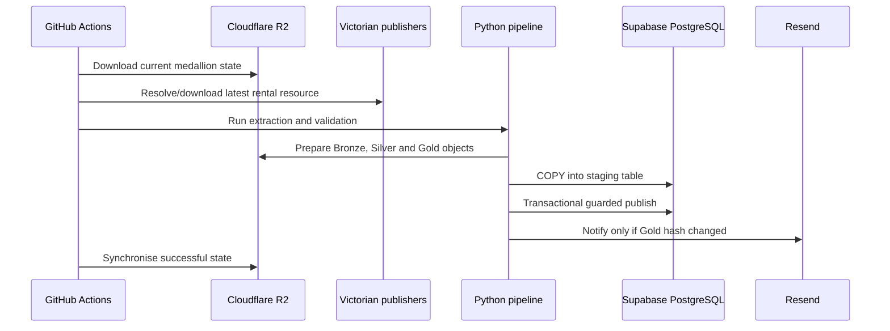

# Architecture and decisions

## System context

The platform answers one bounded question: which Victorian suburb, property-type and bedroom cohorts warrant deeper home-buying or investment research? It combines government median sale prices and rents without claiming property-level valuation accuracy.

The current production path is free-first. Azure is retained as a compatible enterprise target, not deployed alongside the free stack.

| Capability | Current implementation | Optional Azure target |
|---|---|---|
| Orchestration | GitHub Actions | Azure Functions or Data Factory |
| Object storage | Private Cloudflare R2 | ADLS Gen2 |
| Gold DBMS | Supabase PostgreSQL | Azure SQL Database |
| Secrets | GitHub repository secrets | Key Vault + managed identity |
| Dashboard | Streamlit / Power BI | Power BI |
| Monitoring | JSONL logs + Actions artifacts | Application Insights / Log Analytics |

## Component flow

If validation, database loading or publishing fails, the job exits non-zero and uploads logs. The database transaction preserves the previous published Gold table.

## Architecture decisions

### ADR 001 — Medallion architecture

Status: accepted.

Bronze is an immutable record of publisher payloads and manifests. Silver is typed, validated and reusable. Gold is decision-ready and relational. Consumption tools cannot bypass Gold.

### ADR 002 — Start without Spark

Status: accepted.

The official workbooks are small and a complete VGV run currently produces 16,241 Silver rows. Pandas, PyArrow and SQL are simpler and cheaper. Reconsider Spark only when measured backfills, parcel-level spatial joins or runtime SLOs exceed a single worker.

### ADR 003 — Free-first cloud deployment

Status: accepted.

GitHub Actions, R2 and Supabase preserve Docker, Python, SQL, DBMS, CI/CD and medallion learning outcomes near A$0/month. Azure remains documented for migration when scale, enterprise identity or service-level requirements justify it.

### ADR 004 — Transactional Gold publication

Status: accepted.

The loader truncates and fills `mart.suburb_roi_screen_stage`, calls `mart.publish_roi_screen()` and commits as one transaction. The database function rejects an empty stage. Readers therefore see either the previous certified product or the complete new product.

### ADR 005 — Conservative geography resolution

Status: accepted.

Automated matching is limited to normalized exact suburb names. Combined publisher areas are never split or fuzzily assigned. Exceptions are written to `audit.unmatched_geography`; approved aliases are version controlled in `config/geography_crosswalk.csv`.

### ADR 006 — ROI is an indicative screening metric

Status: accepted.

Gross yield is `weekly rent × 52 ÷ median sale price`. Rent remains at bedroom grain and is matched only to the same property type. The metric excludes operating, financing, tax and transaction costs.

### ADR 007 — Poll frequently, process only changes

Status: accepted.

The workflow runs every 12 hours because it is inexpensive, but VGV and Homes Victoria publish annually or quarterly. SHA-256 manifests prevent unchanged VGV workbooks from creating repeated Bronze/Silver versions, and alert hashes prevent duplicate emails.

## Quality boundaries

- Source adapter: transport, publisher metadata and media type
- Bronze: byte-level evidence, provenance, licence, publication date and SHA-256
- Silver: parsing, types, required columns, valid ranges and stable grain
- Gold: reviewed geography joins, business metrics, score version and DB constraints
- Consumption: read-only certified views and explicit caveats

## Failure strategy

The pipeline fails closed. Unsupported workbook layout, missing columns, impossible values, incomplete manual input, failed database constraints or network errors stop promotion and leave the last published Gold product available. See the [operations runbook](operations-runbook.md).
