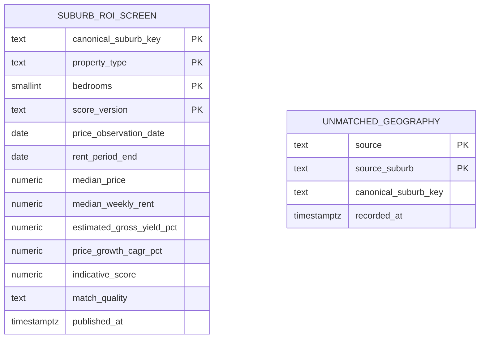

# Data model and metrics

## Source grains

| Dataset | Natural grain | Important measures |
|---|---|---|
| VGV annual sales | suburb × property type × year | median price |
| Homes Victoria rents | rental suburb/area × property type × bedrooms × quarter | bond count, moving-annual median weekly rent |

VGV prices are property-type medians and do not have bedroom grain. A two-bedroom and four-bedroom rental cohort in the same suburb therefore use the same property-type price denominator. The field `yield_basis` makes this limitation explicit.

## Gold PostgreSQL schemas



`mart.suburb_roi_screen_stage` mirrors the published ROI columns and exists only as a guarded loading boundary. `mart.vw_dashboard_roi` is the intended dashboard surface.

## Metric definitions

### Estimated gross yield

```text
estimated_gross_yield_pct = median_weekly_rent × 52 ÷ median_price × 100
```

This is an indicative gross yield. It is not net yield and does not include vacancy, expenses, tax or finance.

### Historical price CAGR

```text
price_growth_cagr_pct = ((latest median price ÷ first median price) ^ (1 ÷ years) - 1) × 100
```

CAGR is calculated only when at least one year separates the first and latest observation. It describes historical medians and is not a forecast.

### Indicative score

```text
indicative_score = yield percentile × 60 + price-CAGR percentile × 40
```

The score is relative to the candidates present in that run. It is versioned as `roi_screen_v1`; changing weights or cohort logic requires a new version.

## Geography contract

Names are normalized conservatively—case, punctuation and known jurisdiction suffixes are standardized. Only exact normalized matches or reviewed aliases are eligible for the ROI join. Add approved aliases to `config/geography_crosswalk.csv`; review `audit.unmatched_geography` before making changes.

## Example analytical queries

```sql
select
    canonical_suburb_key,
    property_type,
    bedrooms,
    estimated_gross_yield_pct,
    price_growth_cagr_pct,
    indicative_score
from mart.vw_dashboard_roi
where property_type = 'house'
order by indicative_score desc
limit 20;
```

```sql
select source, count(*) as unmatched_names
from audit.unmatched_geography
group by source
order by unmatched_names desc;
```

## Interpretation rules

- Compare like property types.
- Retain bedroom grain when comparing rents.
- Treat low bond counts as weaker rental evidence.
- Investigate dates; price and rent observations are not necessarily contemporaneous.
- Use the score to create a research shortlist, then assess supply, planning, hazards, amenities and property-level costs separately.
