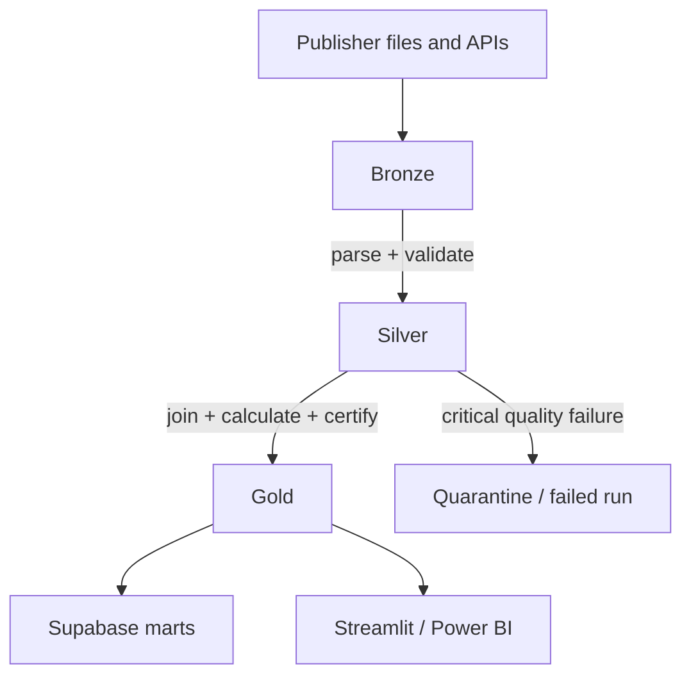

# Medallion data architecture

## Purpose

The medallion design separates source evidence from cleaned analytical contracts and business-facing outputs. A defect in a later layer can be corrected and replayed without losing the original publisher payload.



## Bronze

Bronze stores source bytes unchanged and adds a `manifest.json` containing run ID, source, entity, URL, media type, observation/publication dates, licence, byte count, SHA-256 and object path.

Example:

```text
bronze/vgv_annual_sales/suburb_sales_house/
  extract_date=2026-07-10/
    run_id=<uuid>/
      payload.xlsx
      manifest.json
```

Rules:

- Never edit an existing payload.
- Use a new run ID for changed content.
- Keep raw files private.
- Do not promote incomplete three-file VGV drops.
- Treat R2 folder-marker objects as metadata, not files.

## Silver

Silver stores typed Parquet with a stable analytical grain.

```text
silver/property_market/suburb_sales_house/observation_year=2025/run_id=<uuid>.parquet
silver/property_market/suburb_sales_unit/observation_year=2025/run_id=<uuid>.parquet
silver/property_market/suburb_sales_residential_land/observation_year=2025/run_id=<uuid>.parquet
silver/rental_market/moving_annual_rents_by_suburb/observation_year=2025/run_id=<uuid>.parquet
```

Transformations include workbook-layout discovery, wide-to-long reshaping, date parsing, numeric coercion, property-type normalization, removal of summary rows from Gold inputs and required-column/range validation.

Silver does not invent geography relationships. Source suburb labels remain traceable.

## Gold

Gold contains four products:

- `mart_vgv_price_history`: deduplicated annual price history
- `mart_homes_rent_history`: deduplicated bedroom-grain rental history
- `mart_suburb_roi_screen`: matched current screening features
- `dq_unmatched_geographies`: records excluded from the ROI join

Parquet and CSV copies remain in R2. The current ROI screen and unmatched-geography audit are also loaded into Supabase.

## Promotion gates

| From | To | Required gate |
|---|---|---|
| Source | Bronze | Download/read succeeds; metadata and SHA-256 recorded |
| Bronze | Silver | Recognized layout, required fields, valid types and critical checks pass |
| Silver | Gold histories | Both official price and rent datasets exist |
| Gold histories | ROI screen | Same property type, exact/reviewed suburb match, bedroom rent available |
| ROI screen | Supabase | Non-empty stage, DB constraints pass, transaction commits |

## Idempotency and replay

The scheduled job downloads R2 first. It hashes the canonical VGV input set and compares those hashes with existing Bronze manifests. Unchanged inputs are not re-ingested. Rental runs are deduplicated at Gold grain. Alert state stores the last Gold content hash.

To replay a transformation, use preserved Bronze bytes with updated tested code. Never modify history to make a failed transformation appear successful.

## Why Spark is not used

The current data volume fits comfortably in memory and completes within a small GitHub runner. Spark would add cluster/runtime cost without improving the present workload. Introduce it only after measurement shows a need, while keeping the same Bronze/Silver/Gold contracts.
